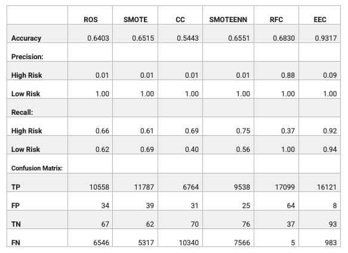

# credit_risk_analysis

##
Purpose

The purpose of this analysis is to apply six different machine learning models to predict credit risk. 

##
Results

###
LendingClub provided a dataset of credit, which is inherently unbalanced as the number of good loans outnumber
risky loans. The following are the six models that were applied. 
•	Random Over Sampling (ROS): Oversampling approach in which the minority class are randomly selected and added
to the training set until the majority and minority classes are balanced. 

•	Synthetic Minority Oversampling Technique (SMOTE): Oversampling approach in which new instances of minority
class are interpolated. 

•	Cluster Centroids (CC): Undersampling approach in which the size of majority class is decreased. The
algorithm identifies clusters of the majority class, then generates synthetic data points that are
representative of the clusters. 

•	SMOTEENN: Is a two-step process that combines oversampling the minority class with SMOTE and cleans the 
resulting data with an undersampling strategy using Edited Nearest Neighbors (ENN). 

•	Random Forest Classifier (RFC): Samples data and builds several smaller, simpler decision trees. In the 
analysis, the number of estimators was set to 100. 

•	Easy Ensemble Classifier (EEC): A model is trained then evaluated. After evaluating the errors of the first
model, another model is trained. The process is repeated until the error rate is minimized. In the analysis,
the number of estimators was set to 100. 

After running the above sampling models, below is a summary of key metrics, including accuracy, precision, 
sensitivity (referred to as recall), and confusion matrix for each model.  

•	Accuracy: Accuracy of the overall model is calculated as true instances (i.e. TP and TN) divided by total
instances (i.e. TP + TN + FP + FN). For models that result in a low accuracy, it is best to fine tune before 
looking further into other metrics. Models ROS, SMOTE, SMOTEENN and RFC showed an accuracy greater than 60%. 
Model EEC showed the highest accuracy at 93% and CC showed the lowest accuracy at 54%. 

•	Precision: Precision is calculated as the number of instances (e.g. high risk) identified divided by the 
total number of instances identified. Models with low precision percentages reflect that reliance is low that
instances identified as high risk were actually high risk. Model RFC showed the highest precision for high risk 
at 88%. The precision showed by all other models ranged between 1% and 9%. 

•	Sensitivity: Sensitivity is calculated by the number of instances (e.g. high risk) identified divided by the
total number of instances in existence. Model EEC showed the highest recall for high risk at 92%, while model
RFC showed the lowest recall at 37%. The recall shown by all other models ranged between 61% and 75%. 

##
Summary

###
As the focus of the analysis is to predict high risk, based on the results obtained, the recommendation is to
use model EEC for the following reasons:

•	Model reflected the highest accuracy at 93%, meaning the model is performing well to differentiate between 
low and high risk loans.

•	Model reflected the highest recall for high risk at 92%, meaning that the model performed well in identifying 
loans that are high risks as high risk. The confusion matrix shows that only 8 high risk loans were identified
as low risk.

•	Although the model showed a precision for high risk at 9%, this is less critical as it results in a higher 
number of low risk loans being identified as high risk. 

